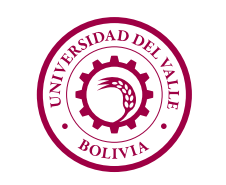

# Bienvenido a Univalle Voz Assistant 🚀

## Descripción 📘

Univalle Voz Assistant es un asistente virtual interactivo diseñado para mejorar la experiencia de los estudiantes y visitantes en la Universidad del Valle. Utilizando tecnologías de inteligencia artificial, el asistente es capaz de reconocer a los estudiantes mediante reconocimiento facial y proporcionar información relevante a través de una interfaz amigable y accesible en una tablet.

## Funcionalidades 🌟

- **Reconocimiento Facial:** Identifica a los estudiantes y personaliza la interacción.
- **Reconocimiento de Voz:** Permite a los usuarios interactuar con el sistema mediante comandos de voz.
- **Interfaz Intuitiva:** Diseñada para ser fácil de usar y accesible para todos.
- **Información Personalizada:** Ofrece datos relevantes sobre horarios, materias y eventos en la universidad.

## Tecnologías Utilizadas 💻

- **Frontend:** Flutter
- **Backend:** Python (Flask/FastAPI)
- **IA:** Modelos de reconocimiento facial y de voz

## Contribuciones 🤝

Nos encantaría contar con tu ayuda para mejorar Univalle Assistant. Si estás interesado en contribuir, por favor revisa nuestra [guía de contribución](CONTRIBUTING.md).

## Licencia 📄

Este proyecto está bajo la Licencia MIT - mira el archivo [LICENSE.md](LICENSE.md) para más detalles.

---

Gracias por visitar nuestro proyecto. ¡Esperamos que tengas un gran día!

